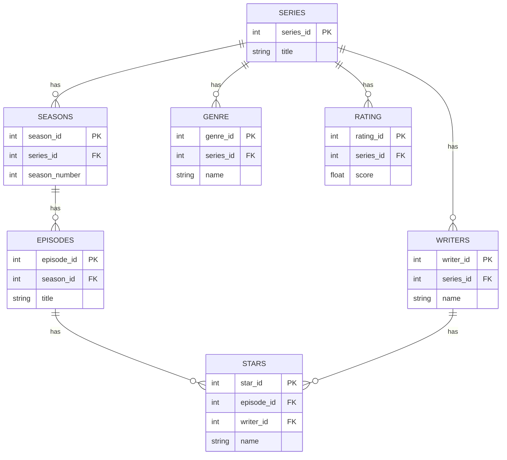

# Design Practice

```mermaid
erDiagram
    SERIES ||--o{ SEASONS : has
    SERIES ||--o{ GENRE : has
    SERIES ||--o{ RATING : has
    SERIES ||--o{ WRITERS : has
    SEASONS ||--o{ EPISODES : has
    EPISODES ||--o{ STARS : has
    WRITERS ||--o{ STARS : has

    SERIES {
        int series_id PK
        string title
    }
    SEASONS {
        int season_id PK
        int series_id FK
        int season_number
    }
    GENRE {
        int genre_id PK
        int series_id FK
        string name
    }
    RATING {
        int rating_id PK
        int series_id FK
        float score
    }
    WRITERS {
        int writer_id PK
        int series_id FK
        string name
    }
    EPISODES {
        int episode_id PK
        int season_id FK
        string title
    }
    STARS {
        int star_id PK
        int episode_id FK
        int writer_id FK
        string name
    }
```